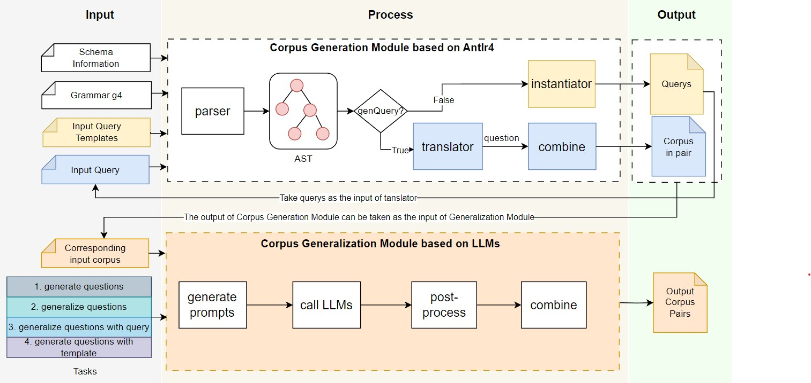
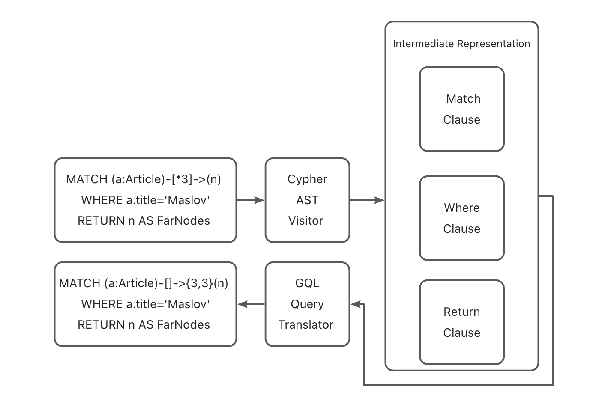
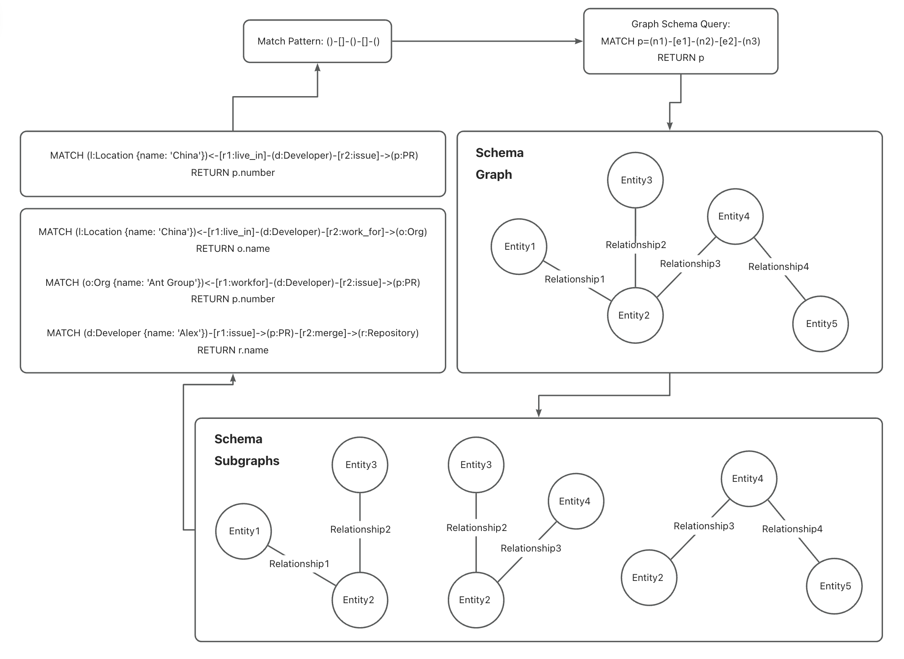

# Awesome-Text2GQL

[](https://github.com/TuGraph-family/Awesome-Text2GQL/stargazers)
[](https://github.com/TuGraph-family/Awesome-Text2GQL/forks)
[](https://github.com/TuGraph-family/Awesome-Text2GQL/contributors)
[](https://github.com/TuGraph-family/Awesome-Text2GQL/commits/master)
[](https://www.apache.org/licenses/LICENSE-2.0.html)
[](https://github.com/TuGraph-family/Awesome-Text2GQL/releases)

## Introduction

Awesome-Text2GQL is an AI-assisted framework for Text2GQL dataset construction. The framework supports translation, generalization and generation of Text2GQL corpus and corresponding database instance. With the assistance of this framework, users are able to construct a high quality Text2GQL dataset on any graph query language(ISO-GQL, Cypher, Gremlin, SQL/PGQ, etc.) with a significantly lower cost than pure human labor annotation.



### Key Features

+ **Translation**

  + [x] **Question translation** from graph query languages to questions in different natural languages to accelerate question annotation.

  + [x] **Query translation** between different graph query languages to gather corpus from all existing graph query languages.

+ **Generalization**

  + [x] **Question generalization** for getting natural language questions in different language style but with same semantic meaning to increase the diversity of corpus.

  + [x] **Query generalization** for instantiating similar query patterns on different graph schemas to increase the diversity of corpus.

+ **Generation**

  + [x] **Schema generation** for automatically generating complex graph database schemas from natural language domain descriptions.

  + [x] **Data generation** for generating realistic simulation data that follows statistical distributions (power-law, long-tail, normal distribution, etc.).

  + [x] **Corpus generation** for producing high-quality Question-Query pairs with complex queries (multi-hop, nested queries) through iterative enhancement strategies.

## Demo: TuGraph-DB ChatBot

TuGraph-DB ChatBot is a demo demonstrates the effect of an agent trained by the corpus generated by Awesome-Text2GQL. It can intercract with the TuGraph-DB taking how you want to operate the db in Chinese as input, such as querying or creating data. And The ChatBot will also help you to excute the cypher too.


Refer to [demo](./chatbot_demo/README.md) for more information.

## Quick Start

### Environment Preparation

It is recommended to use poetry to manage your python environment while other tools may also work.

```
# install poetry and poetry shell
pip install poetry
pip install poetry-plugin-shell

# install environment
poetry install

# activate virtual environment
poetry shell
```

### LLM Setup

#### Remote LLM Setup

To run Awesome-Text2GQL funtions based on remote LLMs，apply API-KEY before you start.

1. Apply API-KEY

Awesome-Text2GQL's remote LLM client is based on the Qwen Inference Service served by Aliyun, you can refer to [Aliyun](https://help.aliyun.com/zh/dashscope/developer-reference/acquisition-and-configuration-of-api-key?spm=a2c4g.11186623.0.0.4e202a9dXlz5vH#1e6311202fthe) to apply the API-KEY.

2. Set API-KEY via environment variables (recommended)

```
# replace YOUR_DASHSCOPE_API_KEY with your API-KEY
echo "export DASHSCOPE_API_KEY='YOUR_DASHSCOPE_API_KEY'" >> ~/.bashrc
source ~/.bashrc
echo $DASHSCOPE_API_KEY
```

#### Local LLM Setup

Awesome-Text2GQL's local LLM client is based on transformers library, use model id from HuggingFace model hub if you can access HuggingFace or use the related local file path where the LLM model is. Add model_path when initializing llm client if you want to use local LLM instead of remote LLM.

### Run Example

#### Generate Schema

`python ./examples/generate_schema.py`

This example shows how to use Awesome-Text2GQL Framework to generate a graph schema for use in corpus construction.

#### Generate Data

`python ./examples/generate_data.py`

This example shows how to use Awesome-Text2GQL Framework to generate data instances based on a given graph schema file.

#### Generate Corpus

This example shows how to use the Awesome-Text2GQL framework to generate a corpus. Before running it, ensure you have a running database instance and update the database connection and output configuration in examples/generate_corpus.py. Alternatively, you can import our provided test dataset into TuGraph. Download link:`https://xxxx.com`.

Example TuGraph import command:

```shell
# lgraph_import -u admin -p 73@TuGraph -c import_config.json --dir /var/lib/lgraph/data/ --overwrite true -v 3
```

After all, run:

`python ./examples/generate_corpus.py`

When the script finishes, the generated corpus will be saved to the output directory specified in the script.

#### Cypher2GQL

`python ./examples/cypher2gql.py`

This example shows how to use AwesomeText2GQL Framework to translate neo4j's Text2Cypher corpus into Text2GQL corpus with queries aligned to ISO-GQL grammar.

#### Generalize Cypher Corpus

`python ./examples/generalize_corpus_cypher.py`

This example shows how to use AwesomeText2GQL Framework to generalize from one cypher corpus pair to construct a Text2GQL corpus dataset.

#### Generalize GQL Corpus

`python ./examples/generalize_corpus_gql.py`

This example shows how to use AwesomeText2GQL Framework to generalize from one ISO-GQL corpus pair to construct a Text2GQL corpus dataset.

#### English to Chinese

`python ./examples/english_to_chinese.py`

This example shows how to use AwesomeText2GQL Framework to translate English question into Chinese question with the same semantic meaning.

#### AST Printing

`python ./examples/print_ast.py`

This example shows how to use AwesomeText2GQL Framework to print the ast of a query. Visualizing the AST is helpful for IR and other AST related development.

## Modules

Awesome-Text2GQL use Translator, Generalizer and Generator to assit the entire process of Text2GQL dataset construction.

### Translator

Translator supports multilingual tranlsation for question translation and multi-graph-query-language translation for query translation. Users can use translator to translate existing corpus in different natural language and graph query language into target natural language and graph query language.

#### Question Translator

Question translator currently has the ability to translate a query into a natural language question(English) with a similar query template and corresponding question template. In the future, we will support multilingual translation of natural language question.

``` python
from app.core.llm.llm_client import LlmClient
from app.core.translator.question_translator import QuestionTranslator

llm_client = LlmClient(model="qwen-plus-0723")
query_template="MATCH (n:Person)-[:HAS_CHILD*1]->(n) WHERE n.name = 'Vanessa Redgrave' RETURN n"
question_template="Who are Roy Redgrave's second generations?"
query_list = [
    "MATCH (n1:person)-[e1:acted_in]->{1,1}(n2:movie) WHERE n1.id = 'Neo' RETURN n2.`duration` AS `DURATION`",
    "MATCH (n1:person)-[e1:directed]->{1,1}(n2:movie) WHERE n1.name = 'MacQUeen' RETURN n2.id AS ID",
    "MATCH (n1:person)-[e1:produce]->{1,1}(n2:movie) WHERE n1.name = 'Hans' RETURN n2.rated AS RATED"
    ]

# translate query into question
question_translator = QuestionTranslator(llm_client=llm_client, chunk_size=5)
question_list = question_translator.translate(
    query_template=query_template,
    question_template=question_template,
    query_list = query_list
)
```

#### Query Translator



Query translator has the ability to translate queries in one query language into another, like cypher to gql. To achieve this, Awesome-Text2GQL designed and implemented a set of intermediate representation for commonly used graph query languages(ISO-GQL, Cypher, Gremlin, SQL/PGQ, etc.) and their dialects. With ast vistitor's implementations, different graph query language can be translated into the intermediate representation. With the query translator's implementations, intermediate representation can be translated into different graph query language.

``` python
from app.impl.iso_gql.translator.iso_gql_query_translator import IsoGqlQueryTranslator as GQLTranslator
from app.impl.tugraph_cypher.ast_visitor.tugraph_cypher_query_visitor import TugraphCypherAstVisitor

query_visitor = TugraphCypherAstVisitor()
gql_translator = GQLTranslator()
cypher = "MATCH (n:Person)-[:HAS_CHILD*1]->(n) WHERE n.name = 'Vanessa Redgrave' RETURN n"

# translate cypher to gql
success, query_pattern = query_visitor.get_query_pattern(cypher)
if success:
    gql = gql_translator.translate(query_pattern)
```

### Generalizer

Generalizer supports the corpus generalization based on the given query template and question template. Users can use generalizer to construct a large scale corpus dataset across multiple database instance from a limited number of existing corpus templates.

#### Question Generalizer

Question generalizer has the ability to generalize the given natural language question into similar questions with different language styles, and the symantic similarity is ensured with the given corresponding query. This generalization aims to increase the linguistic diversity of corpus to simulate the real world Text2GQL scenario.

``` python
from app.core.generalizer.question_generalizer import QuestionGeneralizer
from app.core.llm.llm_client import LlmClient

llm_client = LlmClient(model="qwen-plus-0723")
question_generalizer = QuestionGeneralizer(llm_client)
corpus_pair_list = [
    [
        "MATCH (n:Person)-[:HAS_CHILD*1]->(n) WHERE n.name = 'Vanessa Redgrave' RETURN n",
        "Who are Roy Redgrave's second generations?"
    ]
]

# generalize question
generalized_corpus_pair_list = []
for corpus_pair in corpus_pair_list:
    query = corpus_pair[0]
    question = corpus_pair[1]
    generalized_question_list = question_generalizer.generalize(
        query=query,
        question=question
    )
    for generalized_question in generalized_question_list:
        generalized_corpus_pair_list.append((query, generalized_question))
    generalized_corpus_pair_list.append((query, question))
```

#### Query Generalizer



Query generalizer has the ability to generalize the given query into queries with similar query pattern on the given schema. With the intermediate representation for graph query languages, Awesome-Text2GQL can translate a query into intermediate query pattern, and the similar query pattern can be constructed with different variables on different schema. This generalization aims to migrate existing query patterns onto new database instance efficiently.

``` python
from app.core.generalizer.query_generalizer import QueryGeneralizer
from app.impl.tugraph_cypher.ast_visitor.tugraph_cypher_query_visitor import TugraphCypherAstVisitor

db_id = "movie"
instance_path = "../app/impl/tugraph_cypher/generalizer/base/db_instance/movie"
query_visitor = TugraphCypherAstVisitor()
query_generalizer = QueryGeneralizer(db_id, instance_path)
query_template="MATCH (n {name: 'Carrie-Anne Moss'}) RETURN n.born AS born"

# generalize cypher query
query_list = query_generalizer.generalize_from_cypher(query_template=query_template)
```

``` python
from app.core.generalizer.query_generalizer import QueryGeneralizer
from app.impl.iso_gql.translator.iso_gql_query_translator import IsoGqlQueryTranslator as GQLTranslator
from app.impl.tugraph_cypher.ast_visitor.tugraph_cypher_query_visitor import TugraphCypherAstVisitor

db_id = "movie"
instance_path = "../app/impl/tugraph_cypher/generalizer/base/db_instance/movie"
query_generalizer = QueryGeneralizer(db_id, instance_path)
query_visitor = TugraphCypherAstVisitor()
gql_translator = GQLTranslator()
query_template="MATCH (n:Person)-[:HAS_CHILD*1]->(n) WHERE n.name = 'Vanessa Redgrave' RETURN n"

# generalize gql query
query_list = []
success, query_pattern = query_visitor.get_query_pattern(query_template)
if success:
    query_pattern_list = query_generalizer.generalize(query_pattern=query_pattern)
    for query_pattern in query_pattern_list:
        query = gql_translator.translate(query_pattern)
        query_list.append(query)
```

### Generator

The framework implements a full-chain automated generation pipeline: **Schema Generation → Graph Database Instance Construction → Complex Corpus Generation**. This transforms the traditional "manual template design & semi-automatic corpus generation" model into a new paradigm of fully automated generation.


The system consists of four highly cohesive, loosely coupled core modules:

| **Module** | **Function Description** |
|------------|--------------------------|
| **Schema Generator** | Parses graph database Schema (nodes/edges/properties/indexes), extracts Schema for data Generator use |
| **Data Generator** | Generates simulated node and edge data based on Schema, supporting large-scale complex relationship network construction |
| **Corpus Generator** | Uses LLM to generate high-quality Question-Query pairs containing multi-hop queries, nested queries |
| **Validator** | Checks the correctness of generated Schema, and the grammatical/semantic correctness of Query |

#### Schema Generator

The Schema Generator module automatically creates complex graph database schemas from natural language domain descriptions. It introduces Domain and Subdomain concepts to enhance semantic hierarchy and implements a quantifiable graph structure generation strategy based on a 5-level complexity model.

**Key Features:**

+ Generates Schema Graph format schemas convertible to TuGraph modeling files
+ Supports quantitative control over schema complexity through predefined node and relationship ranges
+ Uses LLM to generate Schema Descriptions and corresponding Schema JSON
+ Ensures polymorphism through SchemaGraph class for future database adapters


#### Data Generator

The Data Generator module creates realistic simulation data based on generated schemas, following real-world statistical distributions like power-law, long-tail, and normal distributions.

**Key Features:**

+ Generates node and edge CSV files with property constraints (INT64, DATE, STRING)
+ Creates TuGraph-compatible import_config.json for batch importing via lgraph_import
+ Handles common import errors (type parsing failures, missing delimiters, null value handling)
+ Generated 488 CSV files containing ~3,716,332 rows of data during development


#### Corpus Generator

The Corpus Generator produces high-quality Question-Query pairs through a hierarchical generation strategy that balances complexity and diversity.

**Key Features:**

+ Layered generation strategy: first generates simple seed corpus, then complex corpus based on seeds
+ Real validation: all queries are executed and verified on actual graph databases
+ Context-aware generation: uses query execution results as context for LLM enhancement
+ Iterative enhancement: controllable iteration rounds for gradually increasing complexity
+ Generated 800+ high-quality corpus pairs across multiple domains


## Experimental Results

The framework has been extensively tested, generating:

+ **32 Schemas** across 8 domains, with the most complex containing 24 node types and 28 edge types
+ **488 CSV files** containing approximately **3,716,332 rows** of simulated data
+ **800+ high-quality Question-Query pairs** with complex queries (multi-hop, nested queries)

Testing on LLM-synthesized datasets shows that the framework successfully generates complex corpora that challenge current LLMs, with execution accuracy below 30% on complex iterated corpora. Fine-tuning experiments demonstrate that models trained on framework-generated data show improved performance.

## Development Guide

To make Awesome-Text2GQL supports the corpus construction of more types of graph query languages, we welcome contribution to the implementation of ast visitor, query translator, and schema parser of new graph query languages. If you find the compatibility of current intermediate representation is not enough for the new graph query language, we also welcome contribution to the intermediate representation.

### Introduction to Intermediate Representation

The clause class is the core of Awesome-Text2GQL's intermediate representation for graph query languages. Currently clause class has match clause, return clause, where clause and with clause as subclasses. The design of subclasses might be updated in the future for the compatibility of more graph query languages

+ Match Clause: the intermediate representation for pattern match

+ Return Clause: the intermediate representation for item return.

+ Where Clause: the intermediate representation for condition expression.

+ With Clause: the intermediate representation for variable control.

### Graph Query Language Implementation Guideline

#### Implement AST Visitor

The ast visitor class is a virtual class and should be implemented for different graph query language, like cypher ast visitor or gql ast visitor. Implementation on each graph query language should be able to parse the given query, visit the abstarct syntax tree, then return the graph pattern(a list of clauses) of the given query as the intermediate representation for further translation or generalization. See `app/impl/tugraph_cypher/ast_visitor/tugraph_cypher_ast_visitor.py` as an example.

#### Implement Query Translator

The query translator class is a virtual class and should be implemented for different graph query language, like cypher query translator or gql query translator. Implementation on each graph query language should implement the translate function to turn a list of clauses(the intermediate representation) into an actual query aligned to the grammar of corresponding language, and implement the grammar check function to check if a query is grammatically correct. See `app/impl/iso_gql/translator/iso_gql_query_translator.py` as an example.

#### Implement Schema Parser

The schema parser class is a virtual class and should be implemented for different DBMS, like neo4j schema parser or tugraph schema parser. Implementation on each DBMS should be able to parse the correspongding schema file, whether it's a set of queries or a json file, then return a in memory schema graph for query generalization. See `app/impl/tugraph_cypher/schema/schema_parser.py` as an example.

## Future Plan

Awesome-Text2GQL will continue to enhance the quality and diversity of generated corpora and improve the framework's usability and performance.

## Contribution

Do the following steps before submitting your code.

### Code Formatting

```
poetry run ruff format .
```

### Code Checking

```
poetry run ruff check ./app ./examples --fix
```

if all check passed, you can submit your code.

### Submitting Code

create a pull request, link it to a related issue, then wait for the project maintainer to review your changes and provide feedback. If your pull request is finally approved by our maintainer, we will merge it. Other details can reference to our [contributing document](https://github.com/TuGraph-family/community/blob/master/docs/CONTRIBUTING.md).

### Contributors Wall

<a href="https://github.com/TuGraph-family/Awesome-Text2GQL/graphs/contributors">
  
</a>

## Attention

This project is still under development, suggestions, issues or pull requests are welcome.
