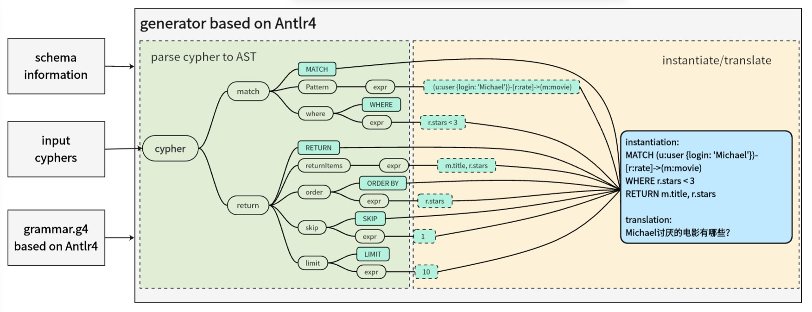

# Awesome-Text2GQL

This is the repository for the text2GQL generator implementation. Awesome-Text2GQL aims to generate cyphers/gqls and corresponding prompts as training corpus for fine-tuning of large language models (LLMs). Based on TuGraph-DB, the training corpus helps to train the Text2GQL and Text2Cypher models that are suitable for TuGraph-DB query engine capabilities.




## Quick Start

### Preparation
For Linux, it is recommended to use miniconda to manage your python environment while other tools may also works.
```
git clone https://github.com/TuGraph-contrib/Awesome-Text2GQL
cd Awesome-Text2GQL
mkdir output
conda create --name antlr4 python=3.10 
conda activate antlr4
```

### Run
Install related python dependency package and the run ./run.sh
```
python setup.py install -v
sh ./run.sh
```
The generator can be run in two modes, that is generating query and generating prompt.
Change `GEN_QUERY` in the `run.sh` to make sure the generator works at the proper mode you want.

`GEN_QUERY=true` means generating cyphers according to cypher templates in batch.

`GEN_QUERY=false` means generating prompts while taking the cyphers generated in the last step as input.

## Attention

This project is still under development, suggestions or issues are welcome.