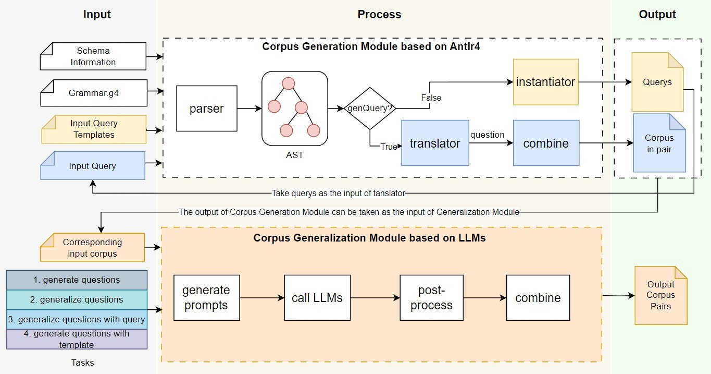

# Awesome-Text2GQL

This is the repository for the text2GQL generator implementation. Awesome-Text2GQL aims to generate cyphers/gqls and corresponding prompts as training corpus for fine-tuning of large language models (LLMs). Based on TuGraph-DB, the training corpus helps to train the Text2GQL and Text2Cypher models that are suitable for TuGraph-DB query engine capabilities.



## TuGraph-DB ChatBot

TuGraph-DB ChatBot is a demo demonstrates the effect of an agent trained by the corpus generated by Awesome-Text2GQL. It can intercract with the TuGraph-DB taking how you want to operate the db in Chinese as input, such as querying or creating data. And The ChatBot will also help you to excute the cypher too.

Refer to [demo](./demo/README.md) for more information.


## Quick Start

### Preparation

#### Environment

For Linux, it is recommended to use miniconda to manage your python environment while other tools may also work.

```
conda create --name text2gql python=3.10 
conda activate text2gql
git clone https://github.com/TuGraph-family/Awesome-Text2GQL.git
cd Awesome-Text2GQL
mkdir output
```

Install related python dependency packages

```
pip install .
```

#### Setup for LLMs

To run generating questions and generalization functions based on LLMs，apply API-KEY before you run the whole flow.

1. Apply API-KEY

We build the corpus generalization module based on the Qwen Inference Service served by Aliyvn, you can refer to [Aliyvn](https://help.aliyun.com/zh/dashscope/developer-reference/acquisition-and-configuration-of-api-key?spm=a2c4g.11186623.0.0.4e202a9dXlz5vH#1e6311202fthe) to apply the API-KEY.

2. Set API-KEY via environment variables (recommended)

```
# replace YOUR_DASHSCOPE_API_KEY with your API-KEY
echo "export DASHSCOPE_API_KEY='YOUR_DASHSCOPE_API_KEY'" >> ~/.bashrc
source ~/.bashrc
echo $DASHSCOPE_API_KEY
conda activate text2gql
```

#### Setup for Local LLMs
To run generating questions and generalization functions based on LLMs, use model id from HuggingFace model hub if you can access HuggingFace or use the related local file path where the LLM model is.

1. Change the model path in each llm related sh file with model id or model local path. If you want to use online LLMs API, please keep model path=""
   
2. You can also change model path in Config.json file to setup your local LLM.

### Run

#### The whole flow

Make sure you have done the preparations above. To experience the whole flow recommended, you can run as below：

```
sh ./scripts/run_the_whole_flow.sh
```

The following steps will be execuated in sequence:

- generate cyphers by generation module based on Antlr4 with templates as input.
- generate questions by generalization module based on LLMs with the cyphers generated in the last step as input.
- generalize the questions generated in the last step by generalization module based on LLMs.
- transform the corpus generated above into model training format.

#### Run parts seperately

##### Cypher generation

```
sh ./scripts/gen_query.sh
```

The corpus generation module can be run in two modes, that is generating querys by instantiator and generating questions by translator.

Set `GEN_QUERY=true` to generate querys according to templates in batch.

##### Question generation

1. generate questions based on LLMs with template as additional input(recommened)

```
sh ./scripts/gen_question_with_template_llm.sh
```

2. generate questions based on LLMs without template as input. It helps to generate questions which don't have corresponding template initially.

```
sh ./scripts/gen_question_directly_llm.sh
```

3. generate questions based on Antlr4(deprecated)

Set `GEN_QUERY=false`  to generate questions using translator of the generation module based on Antlr4.

```
sh ./scripts/gen_question.sh
```

##### Corpus generalization

1. generalize corpus with query and question as input(recommened)

```
sh ./scripts/generalize_llm.sh
```

2. generalize question without querys as input(deprecated)

```
sh ./scripts/general_questions_directly_llm.sh
```

##### Transform

transform the corpus generated above into model training format.

```
sh ./scripts/generate_dataset.sh
```


## Attention

This project is still under development, suggestions or issues are welcome.